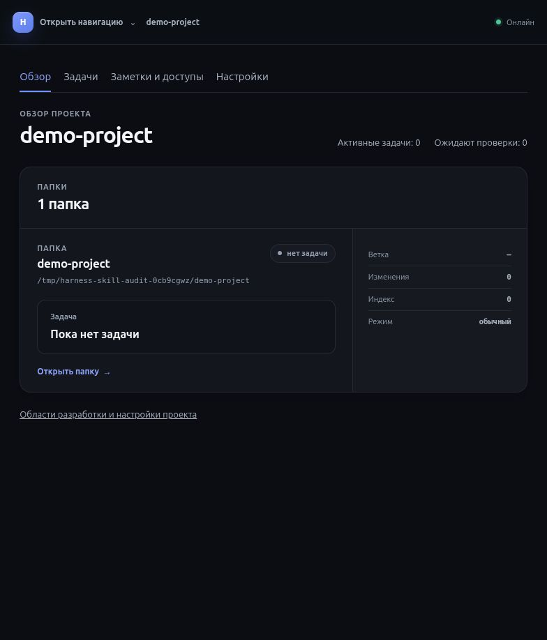
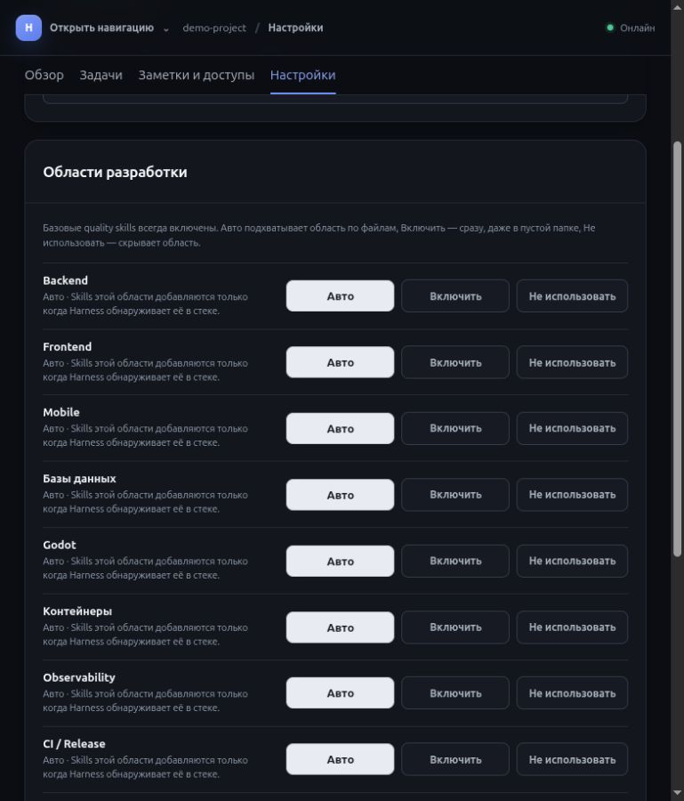
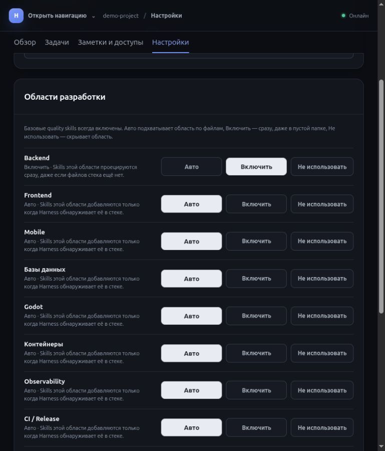
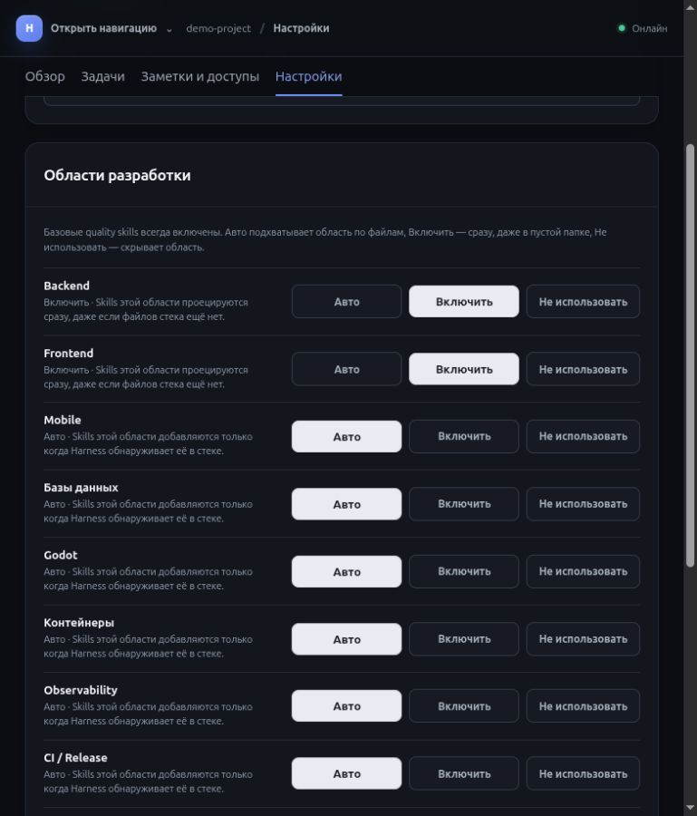
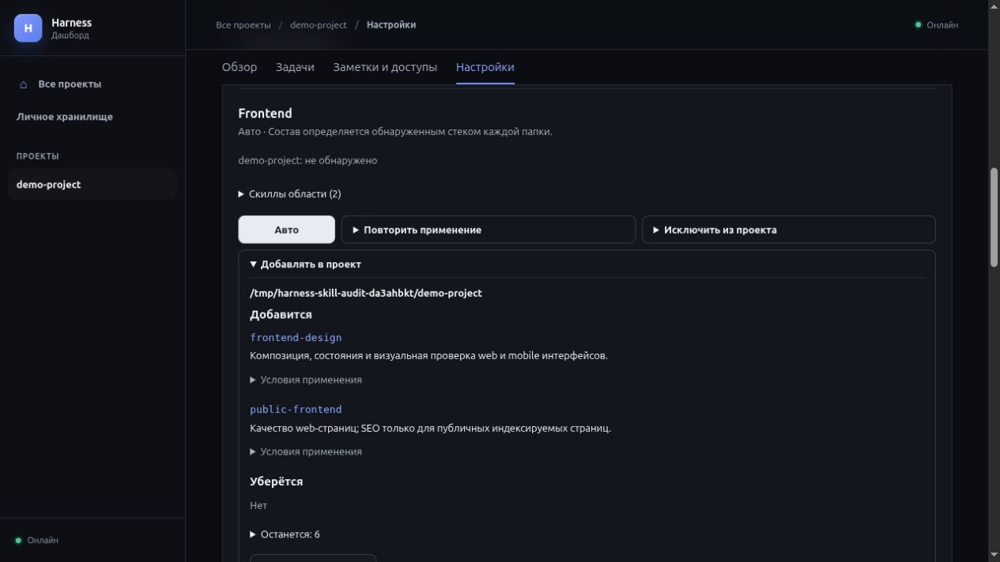
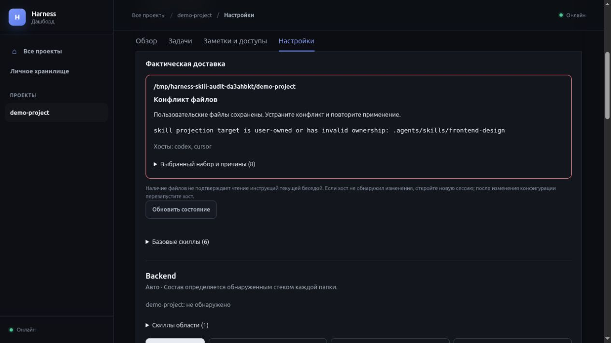
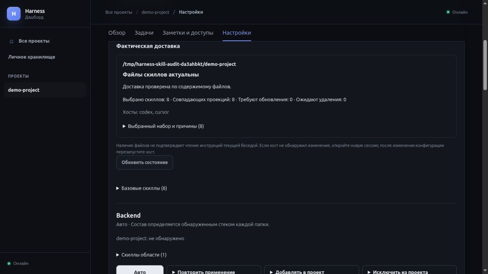

# Аудит поставляемых и фактически доставленных скиллов

Дата: 2026-09-23. Проверено текущее рабочее дерево на базе 21876fed546ed272b0fd79a6a665c335c38332b5, включая существующие незакоммиченные изменения. Harness Task: ecdfdf149bc04ac18a2a065aab4d4256.

Статус документа: исходные наблюдения ниже сохранены как снимок **до исправлений**. После этого оператор разрешил реализацию, обновление проектных скиллов и глобальную установку. Результаты продолжения приведены в разделе «Исправления и повторная проверка».

## Вывод

Текущий встроенный пакет содержит 16 содержательных скиллов, а не заглушки. Есть конкретные процедуры, специализированные справочники и разумные ограничения для небольших изменений. Однако считать задачу качества доставки решённой пока нельзя:

1. Все семь скиллов в проекции этого checkout отличаются от текущего встроенного пакета: 7 из 7 SKILL.md и 19 из 23 связанных reference-файлов. В них сохранились более жёсткие требования, которые исходники уже смягчают.
2. Дашборд показывает выбранную политику как будто скиллы уже добавлены. Воспроизведён случай, когда проекция не удалась, а экран продолжает обещать немедленную доставку.
3. До включения области невозможно узнать её конкретный состав. Автоопределение пропускает существенные случаи, в том числе SQLite и HTTP-сервер самого Harness.
4. Автоматические проверки подтверждают структуру, отбор и безопасную проекцию, но почти не измеряют полезность инструкций в работе модели.

Рекомендуемый первый этап: видимый состав и фактический статус доставки, устранение рассинхронизации пакета через предусмотренный для выбранного runtime путь, затем проверка пользы на коротких сценариях. Массово добавлять новые скиллы до этого не нужно.

## Область и метод

Проверены canonical definitions в src/harness/builtin_skills.py, фактическая проекция .agents/skills, resolver, политика областей, reconciliation, связанные тесты и текущий Dashboard. Изучены specification, исходный spec audit, architecture и ADR-0029/0032/0036/0041/0042/0044/0045/0064 в относящейся к скиллам части. Два независимых направления проверки: содержимое пакета и доставка/покрытие. Дополнительно проверена обоснованность рекомендаций.

UI воспроизведён на текущем DashboardServerManager с отдельной временной БД, новым filesystem Workspace, локальным реестром встроенных скиллов и тестовым профилем Codex. Изменения реальных настроек проекта, глобальной установки и хост-конфигурации не выполнялись. Снимки относятся к этой синтетической копии текущего продукта, а не к пользовательской БД.

## Приоритетные замечания

### A. Фактически доставленные инструкции отстают от исходного пакета

**Высокий приоритет для заявленной цели.** Побайтовое сравнение SKILL.md и связанных references с результатом BuiltinSkill.files() выявило содержательные различия у всех семи проектных скиллов: ci-release, complex-change-planning, language-engineering, legacy-preservation, project-architecture, secure-by-design, testing-strategy. Отличаются 7 из 7 entrypoints и 19 из 23 references. Это не различие служебных заголовков. Проверено содержимое файлов project-native проекции; какие тела скиллов уже прочитала текущая сессия агента, этим сравнением не установлено.

| Что находится в проекции checkout | Что уже предусмотрено исходниками | Возможное следствие |
| --- | --- | --- |
| testing-strategy: «Before publication or merge, run every repository-mandated quality gate for the exact candidate» | Разделены focused checks перед допустимой публикацией и обязательные gates перед merge/release | Старый текст может задерживать публикацию ради полного локального gate |
| language-engineering: читать reference каждого затронутого языка; широкий перечень polyglot-проверок | Только содержательные изменения и реально изменённая граница; косметика не требует обхода справочников | Небольшая правка может получать лишние чтения и проверки |
| Python reference: formatter/linter, type checker, unit и affected integration tests | Проверки выбираются по риску; не нужны тесты случайного текста | Старая инструкция легче превращается в универсальный checklist |
| ci-release: protected environments и required approval для privileged release/deploy | Сохранить существующую policy; не придумывать новое approval для уже разрешённой публикации | Риск лишней остановки или расширения задачи настройкой инфраструктуры |
| secure-by-design: security architecture для каждого нового проекта; verification содержит широкие пункты и N/A | Проверять затронутые границы, не создавать отдельную security-фазу для простой публичной страницы и не перечислять нерелевантное N/A | Риск ритуалов вместо пропорционального анализа |

Якоря фактических инструкций: [.agents/skills/testing-strategy/SKILL.md](../../.agents/skills/testing-strategy/SKILL.md), [.agents/skills/language-engineering/SKILL.md](../../.agents/skills/language-engineering/SKILL.md), [.agents/skills/language-engineering/references/python.md](../../.agents/skills/language-engineering/references/python.md), [.agents/skills/ci-release/SKILL.md](../../.agents/skills/ci-release/SKILL.md), [.agents/skills/secure-by-design/references/verification.md](../../.agents/skills/secure-by-design/references/verification.md). Сравнение: [builtin_skills.py](../../src/harness/builtin_skills.py), строки 130–195, 445–469, 618–639, 1397–1470.

Это подтверждённое расхождение содержимого; фактический лишний прогон тестов или остановка агента в рамках аудита не воспроизводились.

**Дополнение после явного разрешения оператора проверить факты.** Первоначальный отказ на scripts/dogfood mode снят повторной проверкой разрешений с новым разрешением и обоснованием; защитный механизм не обходился. Установлено:

| Проверка | Факт |
| --- | --- |
| scripts/dogfood mode | mode=global; executable /home/gorills/.local/share/uv/tools/harness/bin/harness |
| Metadata установленного пакета | harness 0.1.0.dev0 |
| Установленный builtin_skills.py против checkout | Побайтово одинаковы; SHA-256 ee0800d8ce4bdca2756281bc7757fdce1a70ac33c90185f6f737b2087a0eca3b |
| skill_runtime.py, daemon.py, installation.py | Все три также побайтово одинаковы в установленном пакете и checkout |
| Проекция .agents/skills против локального .harness/skills | Совпадают тела и references всех семи проецируемых скиллов |
| Source-overlay detection | Возвращает /home/gorills/projects/harness |
| Reconciliation без HARNESS_DEV_ROOT, отдельная временная БД | Отказ до чтения реестра и записи проекции: «global Harness does not project skills into a source-checkout overlay» |

Подтверждено, почему старые project-native файлы сохраняются: глобальный маршрут намеренно не обновляет скиллы исходного checkout. В [entrypoints.py](../../src/harness/entrypoints.py), строки 521–534, global-dogfood scan возвращается до host/skill reconciliation; [installation.py](../../src/harness/installation.py), строки 639–642, пропускает source overlay при reconciliation установки; [skill_runtime.py](../../src/harness/skill_runtime.py), строки 189–203, явно отказывает глобальному runtime перед загрузкой registry. Это соответствует ADR-0036. Таким образом, определения скиллов в установленном пакете актуальны относительно checkout, а его локальный изолированный registry и project-native проекция — нет.

Это объясняет сохранение рассинхронизации, но не устанавливает дату и операцию, впервые создавшую старые файлы. Вывод относится к этому source checkout; состояние реестров и проекций остальных проектов не исследовалось. Каноническая пользовательская БД и socket не читались, режим и установка не изменялись. Не следует переносить вывод о skip при scan/install/reconcile на все пути uninstall: cleanup требует отдельной проверки и в этом аудите не запускался.

**Рекомендация:** сделать сравнение версии/содержимого установленного пакета и проекции наблюдаемым для оператора. Обновлять только через владельца соответствующего runtime с проверкой ownership. Не перезаписывать .agents вручную и не смешивать checkout с глобальной установкой. После изменения конфигурации требуется предусмотренный репозиторием restart и новая беседа; наличие новых файлов не доказывает загрузку в текущей сессии.

### B. Сохранённая политика выдаётся за успешную доставку

**Высокий приоритет, воспроизведено.** Временный проект получил шесть базовых скиллов. Backend Include корректно добавил server-application. Затем создан пользовательский .agents/skills/frontend-design/SKILL.md и нажато «Включить: Frontend».

Результат: политика сохранила web-frontend, UI показал «Включить · Skills этой области проецируются сразу», но public-frontend не появился. Повторный вызов reconciliation сообщил: «Workspace skill projection conflicts with tracked or user-owned content». Пользовательский файл остался неизменным — защита ownership работает правильно.

Причина видимого несоответствия: [dashboard.py](../../src/harness/dashboard.py), строки 1158–1181, сначала сохраняет policy, затем возвращает только список Workspace для повторной попытки. HTTP handler, строки 3705–3708, передаёт их в invalidation queue, но не показывает результат доставки. Renderer, строки 1506–1527, выводит только policy. В полном daemon повторная попытка существует, однако постоянный конфликт пользовательского файла от неё не исчезает. Тестовый сервер не запускал watcher; это не влияет на подтверждённое отсутствие сообщения об ошибке в ответе UI.

Аналогично отсутствие профиля хоста приводит к раннему возврату после сохранения policy. Оно не эквивалентно созданным файлам. Для данного исходного checkout в global dogfood подтверждено дополнительное ограничение: Dashboard Include вызывает тот же source-overlay guard в reconcile_workspace_skills. Политика может сохраниться, но проекция из глобального runtime запрещена. UI должен отличать это намеренное ограничение от конфликта пользовательского файла и обычного ожидания повторной попытки.

**Рекомендация:** отдельно показывать «настройка сохранена» и результат по папкам: добавлено / ожидает обновления / конфликт / нет подключённого хоста. Ошибка должна называть конкретный скилл, папку и безопасное следующее действие. Недостаточно заменить текст на более осторожный, сохранив отсутствие диагностики.

### C. Ручное включение скрывает состав и область действия

**P2.** Экран управляет девятью областями, но не раскрывает ID, назначение или содержимое скиллов. «Авто» не говорит, обнаружена ли область и есть ли что-либо на диске. Шесть базовых скиллов названы абстрактно «quality skills», без перечня.

Политика относится ко всем Workspace одного Project и к будущим скиллам с соответствующим facet. Это не установка одного выбранного скилла. Например, Frontend включает и frontend-design, и public-frontend; Mobile — mobile-application и frontend-design. На внутреннем дашборде советы о публичном SEO могут оказаться нерелевантны; наличие public-frontend само по себе не означает, что модель применит их.

Якоря: [skill_policy.py](../../src/harness/skill_policy.py), строки 10–23, 88–131; [skills.py](../../src/harness/skills.py), строки 623–672; [dashboard.py](../../src/harness/dashboard.py), строки 1506–1569; [dashboard_i18n.py](../../src/harness/dashboard_i18n.py), строки 67–84.

**Рекомендация:** preview точного изменения набора, причины выбора и результата по каждой папке. Сохранить существующую модель областей в первом этапе; отдельный выбор каждого скилла потребовал бы нового durable policy и отдельного решения. Не обещать такой выбор в интерфейсе, пока его нет.

### D. Автоопределение не равнозначно полному покрытию проекта

**P2, частично воспроизведено на отдельной фикстуре.**

| Сценарий | Текущий результат | Что нужно уточнить/улучшить |
| --- | --- | --- |
| Python sqlite3, SQL-схема внутри Python, без ORM и .sql | Нет database-backed и data-integrity | Поддержать ограниченные достоверные сигналы или явно предлагать ручное включение |
| ThreadingHTTPServer, без framework из allowlist | Нет backend-service и server-application | Объяснить ограничение Auto; не считать список framework полным определением backend |
| HTML/CSS внутри Python-строк, как в Dashboard | Нет web-frontend и frontend-design | Нужен видимый ручной путь; полный анализ всех строк исходников не является обязательным решением |
| Стандартный logging без стороннего SDK | Нет специализированного observability | Честная граница Auto и понятное включение; не возвращать task_hints как селектор |
| Dart/Flutter | Стек распознаётся, но нет Dart reference и специализированной Flutter-процедуры | Добавить компактное покрытие или явно обозначить ограниченную поддержку |

Для отдельного проекта с pyproject.toml, sqlite3, ThreadingHTTPServer, SQL внутри Python и GitHub Actions scanner вернул только ci-pipeline и software-project. Выбор: ci-release плюс шесть core; data-integrity и server-application отсутствовали. Такие же признаки видны в исходниках Harness. Отсутствие Docker-скилла в текущем проекте ожидаемо: соответствующих признаков не обнаружено.

Якоря: [skills.py](../../src/harness/skills.py), строки 76, 145–183, 493–544, 1344–1402; [builtin_skills.py](../../src/harness/builtin_skills.py), строки 585–615, 642–812, 988–1009, 1055–1125, 1397–1449, 1718–1767; [storage.py](../../src/harness/storage.py), import sqlite3; [dashboard.py](../../src/harness/dashboard.py), ThreadingHTTPServer.

Проекция language-engineering всё равно доступна Flutter-проекту как базовый скилл. Пробел именно в содержании Dart/Flutter, а не в полном отсутствии базовой инженерной дисциплины.

### E. Польза инструкций почти не измеряется

**P2, пробел доказательств.** Тесты проверяют ссылки, metadata, выбор наборов, совместимость и ownership. Некоторые проверки содержания ищут конкретные фразы. Это полезные контракты, но они не отвечают на вопрос, стал ли агент работать лучше и не выполняет ли лишние действия.

Опциональный реальный Codex acceptance с nonce проверяет native discovery/чтение тела синтетического скилла и отрицательный контроль. Это не оценка качества всех 16 инструкций. В этом аудите реальные модельные acceptance-прогоны не выполнялись.

Якоря: [tests/test_builtin_skills.py](../../tests/test_builtin_skills.py), строки 324–346, 387–609, 612–665; [scripts/accept_codex.py](../../scripts/accept_codex.py), флаг --run-model; [docs/host-compatibility.md](../host-compatibility.md).

**Рекомендация:** небольшой набор парных задач с пакетом и без него при одинаковых условиях. Оценивать правильность результата, ненужные изменения, лишние согласования, стоимость чтений/проверок и попадание в нужный справочник. Оценку результата проводить по заранее заданным критериям, по возможности без знания варианта прогона. Один успешный пример или сам факт открытия SKILL.md не доказывает полезность.

### F. Двусмысленное требование к фоновым задачам

**P3, риск формулировки.** В server-application/jobs-integrations.md сначала есть правильная оговорка: локальному helper не нужны queue/outbox/dead-letter ради соответствия гайду. Следующая строка требует для «every job» durable input, idempotency, retry/backoff и terminal/dead-letter/manual repair. Вводная оговорка ограничивает это требование, поэтому нельзя утверждать, что лишняя инфраструктура неизбежна.

Якорь: [builtin_skills.py](../../src/harness/builtin_skills.py), строки 1037–1040. Рекомендация: прямо ограничить полный набор jobs с существенными повторяемыми/теряемыми эффектами и оставить отдельную короткую инструкцию для локального helper. Наблюдаемый вред в модельном прогоне не подтверждён.

## Инвентаризация качества всех 16 скиллов

Оценка относится к текущему встроенному пакету, если не указано обратное. Короткий entrypoint не считается заглушкой: важны действия, границы и доступные references. Суммарно 39 reference-файлов; references есть у 11 из 16 скиллов.

| Скилл | Реальная практическая специализация | Оценка / граница |
| --- | --- | --- |
| testing-strategy | Выбор проверки по риску, focused regression, границы publication/merge | Полезен; текущая проекция существенно жёстче исходника |
| secure-by-design | Trust boundaries, 6 профильных refs, отрицательные проверки | Содержателен; сравнивать с реально доставленной версией |
| container-infrastructure | Dev/test/prod, сборка образа, ресурсы и runtime | Содержателен; не активировать для обычного кода без container scope |
| observability | Логи/метрики/traces, ограниченная кардинальность, стоимость | Содержателен; Auto пропускает стандартные средства |
| ci-release | Права CI, артефакты, происхождение, release policy | Содержателен; актуальные ограничения approval не доставлены сюда |
| public-frontend | Семантика web, индексация, SEO, CWV | Полезен для публичного web; не универсален для internal UI |
| frontend-design | Иерархия, типографика, состояния и визуальная проверка | Полезен и web, и mobile; связан с двумя областями |
| server-application | HTTP-контракт, ограничения ресурсов, jobs/integrations | Содержателен; stdlib HTTP miss и двусмысленное every job |
| mobile-application | Native lifecycle, разрешения, доставка, Expo/RN | Содержателен; Flutter покрыт лишь общими mobile-принципами |
| godot-development | Gameplay/input, UI/localization, rendering/performance | Конкретная предметная инструкция, три refs |
| deployment-operations | Linux service/edge, systemd/Nginx/Ansible, эксплуатация | Содержателен; профиль конкретнее общего слова Deployment |
| project-architecture | Модули, ownership, ADR, измеренные требования к scale | Не требует ADR для каждой обычной правки |
| language-engineering | 13 refs, версии/toolchain/runtime, межъязыковые контракты | Широкая база; отсутствует Dart; старая проекция чрезмерно широка |
| data-integrity | Транзакции, ограничения, миграции, конкурентные записи | Содержателен; не доставляется автоматически для stdlib SQLite |
| complex-change-planning | План рискованного изменения, spec audit, independent review | Ограничен сложными изменениями, не отдельная status-система |
| legacy-preservation | Совместимость, характеристики текущего поведения, миграция | Полезен для существующей системы; в source больше защиты от лишней работы |

Общее пересечение testing/language/legacy/security нормально, если каждый скилл добавляет профильную проверку и уважает узкий scope. Не нужно устранять всякое повторение механическим объединением в один большой скилл. Базовый набор «доступен проекту» не должен означать «обязательно прочитать все шесть для каждой задачи».

## Что действительно добавляет ручной Include

Для текущего штатного реестра; пользовательские и будущие definitions могут расширить набор. Перечень ниже — декларативный состав области, а фактический preview должен вычитать уже выбранные скиллы и учитывать остальные настройки каждой папки.

| Область | Скиллы |
| --- | --- |
| Backend | server-application |
| Frontend | frontend-design, public-frontend |
| Mobile | frontend-design, mobile-application |
| Базы данных | data-integrity |
| Godot | godot-development |
| Контейнеры | container-infrastructure |
| Observability | observability |
| CI / Release | ci-release |
| Deployment | deployment-operations |
| Базовый software-project | complex-change-planning, language-engineering, legacy-preservation, project-architecture, secure-by-design, testing-strategy |

Показ одного и того же frontend-design в Frontend и Mobile не должен создавать дублирующую установку. При исключении одной области preview обязан учитывать другую причину присутствия скилла. Базовые инструкции также могут содержать пересекающиеся советы: «исключить область» не означает запрет модели рассуждать на эту тему.

## Предложение по дашборду

Сохранить существующую страницу настроек, выделив понятный блок «Скиллы проекта».

1. **Сводка:** сколько скиллов выбрано и сколько действительно добавлено, в каких папках есть проблемы. Отдельно раскрываемый список шести базовых с назначением.
2. **Строка области:** человеческое назначение, текущий состав, причина Auto («найден package.json + react» либо «признаков не найдено»). Режимы: «Авто», «Добавлять в проект», «Исключить из проекта». Подсказка уточняет, что меняется доступность специализированных скиллов, а выбор инструкции остаётся у агента.
3. **Перед применением:** встроенный в страницу предпросмотр «добавится / останется / уберётся» по папкам. Для каждого скилла: русское назначение, ID, когда полезен, существенная граница применения и возможность открыть текст. Состав вычислять тем же resolver, что используется при применении, а не второй таблицей отбора в UI.
4. **Применение:** одна явная кнопка «Применить к N папкам проекта». Кратко пояснить, что настройка постоянная и охватывает будущие скиллы этой области. Отдельный обязательный модальный approval не нужен.
5. **Результат:** «Настройка сохранена; добавлено в 1 из 2 папок» и конкретная ошибка оставшейся папки. Повторная попытка должна быть адресной. Не обещать загрузку в текущую беседу: Harness подтверждает файлы, а обнаружение инструкций зависит от хоста. Для надёжного обновления следовать documented restart/reopen, особенно после изменения host config.

Пример preview для пустого тестового проекта после Backend Include:

| Frontend → Добавлять в проект | Результат |
| --- | --- |
| Добавится frontend-design | Композиция, состояния и визуальная проверка web-интерфейса |
| Добавится public-frontend | Семантика, доступность и качество публичных web-страниц; SEO применять только где релевантно |
| Останутся 7 скиллов | Шесть базовых и server-application |
| Область действия | Все зарегистрированные папки этого проекта; новые matching skills тоже будут включаться |
| При конфликте frontend-design | Настройка может быть сохранена, но доставка должна явно показывать ошибку; не перезаписывать пользовательский файл |

Русские summaries нужны оператору, но должны иметь явный источник и проверку соответствия canonical description. Нельзя одновременно обещать выбор отдельного скилла и сохранять только facet. Per-skill policy, split public/internal frontend и новые host-интеграции — отдельные решения после подтверждения потребности.

## Проверенный путь в интерфейсе

### 1. Обзор проекта — переход работает

Есть вкладка «Настройки» и ссылка «Области разработки и настройки проекта». Слово «скиллы» не помогает найти функцию по названию. Существенных проблем самого перехода не обнаружено.

### 2. Области в Auto — состав неизвестен

Режимы и названия видны; повторяющиеся общие пояснения занимают место вместо конкретного состава. «Авто» визуально активно, хотя специализированных скиллов в пустой папке нет. Нет явной причины обнаружения или отсутствия области.

### 3. Backend включён — доставка работает, результат не объяснён

Файлы server-application реально появились. Экран изменил только режим и пояснение; имя добавленного скилла, его содержание и судьба текущей сессии не раскрыты.

### 4. Frontend с конфликтом — сообщение вводит в заблуждение

Экран показывает такую же успешную смену режима, несмотря на конфликт и отсутствие public-frontend. Этот снимок сам по себе не доказывает ошибку: доказательство состоит из него, сохранённой policy, результата reconciliation и проверки файлов, описанных в замечании B.

Все снимки получены и проверены в текущем аудите. Использован штатный viewport in-app browser; длинная страница продолжается ниже видимой области. Снимки охватывают проверенные Backend/Frontend действия, не являются полностраничной съёмкой всех настроек.

Доступность: у кнопок в accessibility tree есть различимые имена «Включить: Backend» и т.п., присутствуют headings и skip-link. Текущий режим представлен span с aria-current, а не выбранным пунктом radio group; совместное восприятие группы и сообщения о применении стоит отдельно проверить клавиатурой/скринридером. На снимках мелкий приглушённый вспомогательный текст; контраст не измерялся. Полный keyboard/mobile/screen-reader аудит и WCAG compliance не заявляются.

## Минимальная матрица проверки пользы

| Сценарий | Ожидаемая польза | Признак помехи |
| --- | --- | --- |
| Косметическая правка внутреннего UI | Проверен изменённый экран | Полный suite, SEO/security фаза, новый test framework |
| Новый публичный экран | frontend-design + релевантные web semantics | Требования native builds или unrelated release |
| Исправление авторизации API | Проверена граница доступа и отрицательный сценарий | Общий checklist вместо конкретного denial test |
| SQLite миграция и параллельная запись | Доступен data-integrity, проверены атомарность/совместимость | Скилл не доставлен либо совет без проверки реальной БД |
| Локальный scheduled helper | Простой управляемый запуск и нужная обработка ошибки | Queue/outbox/dead-letter только ради инструкции |
| Worker с повторной доставкой | Идемпотентность существенного эффекта | Happy-path-only проверка или безусловный retry |
| Python stdlib logging | Ограничены данные, объём и полезные сообщения | Отсутствующее покрытие скрыто за «Auto» |
| Flutter/Dart изменение | Явно обозначенная и затем закрытая языковая граница | Общий mobile skill выдан за полную Flutter-экспертизу |
| Godot input/rebinding | Конкретная input/lifecycle проверка | Универсальные web-инструкции |
| Публикация draft после focused checks | Соблюдена repository policy и разделены publication/merge | Старый skill требует преждевременный full gate/новое approval |

До прогона зафиксировать expected IDs/references, необходимое действие и запрещённое лишнее обязательство. Сохранить trace и оценить результат, а не только число открытых файлов. Для устойчивого вывода нужны повторения и одинаковые model/runtime условия; этот аудит их не подменяет.

## Выполненная проверка

| Проверка | Результат |
| --- | --- |
| test_project_skill_policy, test_builtin_skills, test_skills, test_skill_relevance_reconciliation | 118 passed, 9.01 s; независимый аудитор |
| test_dashboard_actions, test_dashboard, test_codex_skill_surface, test_cursor_skill_surface, test_skill_projection_ownership | 68 passed, 10.65 s |
| Временная scanner/resolver фикстура sqlite3 + stdlib HTTP + GitHub Actions | Пропуски database/backend воспроизведены |
| UI Auto → Backend Include | server-application добавлен, состав не показан |
| UI Frontend Include с пользовательским файлом | Конфликт воспроизведён, файл сохранён, UI не сообщает о провале |
| Сравнение реальной проекции checkout с BuiltinSkill.files() | Все 7 SKILL.md содержательно отличаются |
| Повторная разрешённая проверка dogfood mode и установленного пакета | global; installed builtin definitions совпадают с checkout; локальная проекция совпадает со старым изолированным registry |
| Source-overlay guard на отдельной временной БД | Отказ глобальной проекции воспроизведён до записи файлов |
| Полный quality gate, exact-head CI, реальные модельные efficacy-прогоны | Не запускались; продуктовый код не изменялся |

Команды выполнялись через scripts/dev; pytest использовал изолированные fixtures. Всего 186 проверок прошли. Новых тестов, повторяющих текст рекомендаций, не добавлено. Изменения аудита — этот отчёт и четыре снимка; существующие изменения исходников и фактическая проекция оставлены как были.

## Порядок дальнейшей работы

1. Согласовать этот аудит и первый ограниченный результат: конкретный preview и правдивый статус доставки. Для изменения domain/UI-контракта обновить ADR и документацию, покрыть success/partial failure/no host/multi-Workspace/overlap.
2. Устранить расхождение фактически доставленного набора штатным способом для выбранного runtime; повторить сравнение файлов и проверку в новой беседе. Глобальная установка/смена dogfood режима в этот аудит не входили.
3. Закрыть приоритетные coverage-пробелы и Dart/Flutter-глубину без возвращения Task-based selection или обязательного чтения всего пакета.
4. Выполнить сценарную проверку пользы, начиная с негативных проб на лишние тесты, согласования и инфраструктуру. По её результатам менять тексты и триггеры.

На момент завершения исходного аудита реализация предложений ещё не была начата. Следующий раздел фиксирует последующее разрешённое продолжение.

## Исправления и повторная проверка

Продолжение 2026-09-23/24, по явному разрешению оператора «установи актуальные … поправь … установи всё глобально и перепроверь». Durable Task сохранён прежним. Другие незакоммиченные изменения рабочего дерева сохранены.

### Что исправлено

- Dashboard показывает конкретные skill IDs, короткую цель, оригинальные условия применения, причины выбора и базовый набор. До Apply видны точные «Добавится / Уберётся / Останется» для каждой папки проекта. Настройка остаётся политикой области с учётом будущих обновлений, а не замороженным списком ID.
- Доставка проверяется отдельно по файлам: актуально, требуется обновление/удаление, конфликт, нет хоста, intentional source overlay или ошибка проверки. Сохранённая политика не выдаётся за успешную доставку. Текущий режим можно применить повторно после ремонта.
- Preview и Apply используют один runtime selector хостов, включая isolated dev. Только settings читает каталог/проекции; отдельный settings SSE fingerprint реагирует на исправление файлов без записи в БД.
- Добавлено bounded AST evidence свежих индексированных Python-файлов: SQLite connection, stdlib HTTP server, logging configuration/handler, substantial embedded HTML или CSS+JS. Одни импорты, тесты и примеры не дают специализированных скиллов. Области видимости и затенение импортов учтены; независимый web sibling не подавляется мобильным приложением. Лимиты: 128 файлов, 256 KiB/файл, 2 MiB суммарно; проверяются indexed hash/size и deadline.
- В существующие language/mobile skills добавлены Dart и Flutter references. Требования к повторной доставке фоновой работы привязаны к последствиям потери/дублирования; простой локальный скрипт не обязан заводить очередь.
- Глобальная очистка тоже сохраняет source overlay. Некорректный Cursor config приводит к пропуску конкретного Workspace, а не прерыванию всей уборки.
- Контракт задокументирован в [ADR-0072](../decisions/0072-skill-evidence-and-delivery-preview.md), README и ARCHITECTURE.

### Подтверждённые результаты

Локальное обновление выполнено через `scripts/dev stop` и `scripts/dev harness init` для этого checkout. Host config ожидаемо не пересогласовывался. Теперь выбрано **11** скиллов вместо прежних 7: добавились server-application, data-integrity, frontend-design и public-frontend. Побайтово проверены все **43** portable-файла (11 SKILL.md и 32 references): **0 расхождений** с актуальными BuiltinSkill.files(). Это факт о файлах, не утверждение о повторном чтении текущей беседой.

Независимая correctness review выявила и затем подтвердила устранение четырёх ошибок реализации: lexical shadowing, mobile/web sibling locality, расхождение runtime-профилей preview/POST и неперехваченный malformed Cursor config при cleanup. Повторный прогон соответствующих source/snapshot/HTTP тестов: 27 passed.

В браузере на отдельной временной БД пройден сценарий: preview Frontend показывает ровно frontend-design и public-frontend; Apply при пользовательском конфликте сохраняет файл и показывает его путь; после перемещения конфликтной фикстуры SSE показывает pending; повторный Apply даёт **8 выбранных / 8 совпадающих / 0 ожидающих обновления**. Возврат к Auto удаляет два специализированных owned-скилла и сохраняет шесть базовых.

### Сценарные пробы пользы и пределы вывода

Отдельный агент с новыми инструкциями выполнил три ограниченных задания на временных fixtures:

| Сценарий | Результат |
| --- | --- |
| Изменить подпись кнопки | Изменена только Send → Отправить, без лишней инфраструктуры и тестов |
| Flutter async lifecycle | После await добавлен mounted guard перед setState |
| Локальный scheduled helper | Простой Python stdlib CLI, UTC timestamp, overwrite и обработка ошибки записи; без очередей/outbox |

Python CLI проверен успешной перезаписью, разбором timezone-aware даты, ошибкой записи в каталог и компиляцией. Flutter/Dart tooling отсутствовало: analyzer/widget/device checks **не выполнены**. Эти три пробы не заменяют сравнительный A/B-набор и не доказывают эффективность всех 16 скиллов.

Общий deadline settings остаётся кооперативным: 3 s для stack/projection; загрузка реестра пока без deadline, отдельный overlay Git probe ограничен 5 s. Cursor config больше 1 MiB отклоняется до чтения. Строгая общая latency-гарантия не заявляется. Динамические Python конструкции и файлы за пределами лимитов могут требовать ручного Include.

### Автоматические проверки реализации

- Lock freshness, Ruff format/check и mypy (168 файлов) прошли.
- Общий pytest: **1139 passed, 3 failed**, 288.99 s. Все три сбоя — MCP HTTP fixture не смогла занять порт 17376, занятый локальным daemon после обновления проекции. После штатного `scripts/dev stop` тот же файл тестов прошёл **3 passed, 2.53 s**, без изменений кода. Таким образом, все 1142 теста покрыты успешными проверками; единый первый запуск `scripts/dev quality` имел ненулевой exit и не объявляется прошедшим.
- Оставшиеся компоненты gate выполнены отдельно: benchmark hot-path counter gate — passed; wheel smoke (установка, lifecycle, upgrade, doctor, cleanup в временных корнях) — exit 0.
- `git diff --check` — passed. Exact-head CI и публикация не выполнялись: запрос касался локального исправления и установки, а дерево уже содержало другие незакоммиченные изменения.

### Глобальная установка и реальные проекты

`make accept-global-codex` завершился exit 0 на Codex CLI 0.156.1. Проверены две project config discovery, bootstrap prompt, пять MCP wire tools, различные Workspace identity, untrusted fail-closed и owned cleanup. Временные папки после завершения отсутствуют. [Санитарный JSON-отчёт](assets/2026-09-23-skills-fixed/global-codex-preflight.json) сохраняет точные flags. `model_run=false`: это **не** доказательство чтения native-скилла новой модельной беседой.

`make install-global HOST=codex` установил актуальный uv-tool runtime; обновлено 3 из 16 canonical built-ins. Зарегистрированы 19 проектов/19 Workspace. Конфигурации Codex уже соответствовали актуальному формату: `project overrides changed: 0`, `MCP registration: unchanged`. Глобальный проход согласования скиллов охватил обычные Workspace, исходный Harness сохранён по ADR-0036 и обновлён отдельно локальным путём.

Реальные конфигурации, вошедшие в обход установки (все корни внутри `/home/gorills/projects/`):

| Workspace | Результат перепроверки доставки |
| --- | --- |
| dom-sporta, MultiAgent, reka-landing-backend, food | doctor: current |
| mangazeya-backend, StoryWriter, linux-tools, server-monitoring | doctor: current |
| skupka, games/factorio3, portfolio, thebook.moscow | doctor: current |
| skyhouse.moscow, games/hardcore-rpg, trener, golovolomka | doctor: current |
| food-go-new | Дополнительная read-only проверка живой Dashboard settings: 13/13 current |
| alia | Дополнительная read-only проверка живой Dashboard settings: 11/11 current |
| harness | Dashboard верно сообщает intentional source overlay; локально проверено 11/11 и 43/43 файлов |

`make doctor-global HOST=codex`: exit 0, **67 OK / 7 WARN / 0 FAIL**. Предупреждения сохранены как факты: общий doctor проверяет максимум 16 Workspace и оставляет три за своим бюджетом; Hidden SCM enforcement у установленных хостов не подтверждён. При первом автоматическом doctor после установки было ещё четыре stale index; к отдельной read-only перепроверке watcher обновил их: 16 fresh, 0 stale. Оставшиеся предупреждения не выдаются за полностью зелёную диагностику. Три пропущенных проекта проверены отдельно по доставке через живой Dashboard, как показано выше; это не полная замена всех doctor-проверок этих проектов.

Во время реального обхода обнаружен дополнительный шум от `ast.parse` чужого Python с invalid escape. Подавление ограничено SyntaxWarning в этом AST-вызове; добавлен тест, сначала подтверждающий само предупреждение, затем его отсутствие в детекторе. Все 14 source-evidence тестов, Ruff и mypy прошли; итоговая установка повторена после этого узкого исправления. Общий набор теперь содержит 1143 теста; последний дополнительный тест проверен в focused-прогоне.

Финальная повторная установка: exit 0; встроенный автоматический doctor установленного runtime — **67 OK / 7 WARN / 0 FAIL**, 16 свежих индексов и 16 актуальных проекций. Побайтовое сравнение всех **55 Python-файлов** установленного пакета с текущим `src/harness` — 0 расхождений; SyntaxWarning в финальном журнале отсутствуют. Повторный вызов живого MCP `project_status` успешен, прежние Project/Workspace/Task identity сохранены. Последний focused-прогон source-evidence, HTTP skill UI и overlay cleanup: **22 passed, 4.01 s**.

Результат реализации и установки готов к operator_review. Чтобы новая беседа Codex получила обновлённые инструкции, следует полностью перезапустить клиент и открыть новую беседу в этом проекте. Текущая беседа не используется как доказательство перечитывания своего исходного instruction snapshot.
